# Figma Design Editor — Guia Completo de Funcionalidades

> **Objetivo:** Documentação exaustiva de todas as funcionalidades do editor de design do Figma (rota `/design/...`) para replicação em outros sistemas.
> 
> **Versão analisada:** Figma Web (Abril 2026)
> **Plano:** Free
> **Viewport de análise:** Desktop 1280×800
> **URL:** `https://www.figma.com/design/{id}/Untitled`

---

## 1. LAYOUT DA INTERFACE — DESKTOP

### 1.1 Estrutura Geral

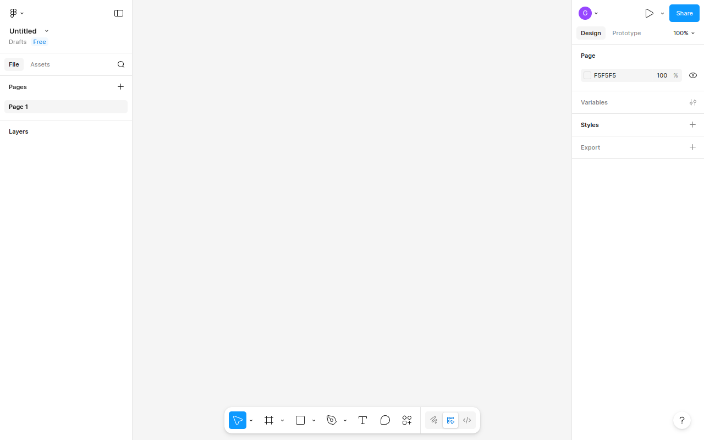

A interface do Figma Design Editor é dividida em 4 áreas principais:

| Área | Posição | Largura | Descrição |
|------|---------|---------|-----------|
| **Top Bar** | Topo | 100% | Logo Figma, nome do arquivo, botões de modo (Design/Prototype), zoom %, avatar, Share |
| **Left Sidebar** | Esquerda | ~230px | File/Assets tabs, Pages, Layers tree |
| **Canvas** | Centro | Flexível | Área de desenho com fundo #F5F5F5, zoom/pan, grid |
| **Right Sidebar** | Direita | ~260px | Design/Prototype tabs, propriedades do elemento selecionado |
| **Bottom Toolbar** | Bottom-center | ~380px | Ferramentas de criação (flutuante, pill-shaped) |
| **Help/Zoom** | Bottom-right | ~40px | Botão de ajuda |

### 1.2 Top Bar

**Lado esquerdo:**
- Logo Figma (dropdown com menu do arquivo)
- Nome do arquivo ("Untitled") — editável com clique
- "Drafts" / "Free" — indicadores de plano

**Lado direito:**
- Avatar do usuário (G)
- Botão Play (apresentação/prototype)
- Botão "Share" (azul, primary action)

### 1.3 Left Sidebar

**Tabs superiores:**
- **File** — mostra Pages e Layers
- **Assets** — mostra componentes e estilos

**Pages:**
- Lista de páginas (ex: "Page 1")
- Botão "+" para adicionar página

**Layers:**
- Árvore hierárquica de elementos
- Cada item mostra: ícone do tipo + nome
- Elementos selecionados ficam highlighted
- Drag-and-drop para reordenar
- Duplo-clique para renomear
- Ícone indica tipo: □ Rectangle, ○ Ellipse, T Text, # Frame, ⊞ Group

### 1.4 Right Sidebar (Properties Panel)

**Tabs:**
- **Design** — propriedades visuais
- **Prototype** — interações
- **Zoom %** — dropdown de zoom

**Quando nada selecionado (Page):**
- Page background color (F5F5F5)
- Opacity (100%)
- Variables
- Styles
- Export

**Quando elemento selecionado:**
- Nome do tipo do elemento (ex: "Rectangle")
- Ícones de ações: Settings, Theme, Component, Bookmark

**Seções de propriedades (em ordem vertical):**

1. **Position**
   - Alignment buttons (6): left, center-h, right, top, center-v, bottom
   - X, Y (coordenadas)
   - Rotation (°)
   - Ícones: Flip H, Flip V, More options

2. **Layout**
   - W (width), H (height)
   - Ícone de lock aspect ratio (chain link)

3. **Appearance**
   - Opacity (%) com slider
   - Corner radius com ícone de edição individual
   - Blend mode dropdown

4. **Fill**
   - Cor com swatch + hex + opacity
   - Ícone eye (visibilidade)
   - Botão "+" para adicionar fill
   - Botão "−" para remover
   - Botão "⊞" para configuração avançada

5. **Stroke**
   - Botão "+" para adicionar
   - Quando ativo: cor, peso, posição (inside/outside/center), tipo (solid/dashed)

6. **Effects**
   - Botão "+" para adicionar
   - Tipos: Drop shadow, Inner shadow, Layer blur, Background blur

7. **Export**
   - Botão "+" para adicionar configuração
   - Formato, escala, sufixo

### 1.5 Bottom Toolbar (Ferramentas)

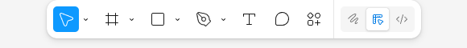

**Formato:** Pill-shaped flutuante, centralizada no bottom do canvas.

**Ferramentas (esquerda → direita):**

| # | Ícone | Nome | Atalho | Tipo | Dropdown |
|---|-------|------|--------|------|----------|
| 1 | ➤ | Move / Scale | V / K | Seleção | Sim (Move, Scale) |
| 2 | # | Frame / Section | F / Shift+F | Container | Sim (Frame, Section) |
| 3 | □ | Rectangle / Shape | R | Forma | Sim (Rectangle, Line, Arrow, Ellipse, Polygon, Star, Place image) |
| 4 | ✒ | Pen / Pencil | P / Shift+P | Vetor | Sim (Pen, Pencil) |
| 5 | T | Text | T | Texto | Não |
| 6 | 💬 | Comment | C | Anotação | Não |
| 7 | ⊞ | Components | — | Componentes | Não |

**Separador, depois:**
| # | Ícone | Nome | Descrição |
|---|-------|------|-----------|
| 8 | 🖊 | Pen tool variant | — |
| 9 | 🤖 | AI (Figma AI) | — |
| 10 | </> | Dev Mode | Toggle |

---

## 2. FERRAMENTAS DE CRIAÇÃO (Draw-to-Create)

### 2.1 Comportamento Padrão

Quando uma ferramenta de criação é selecionada (R, O, F, T, L):

1. **Cursor muda** para crosshair (+)
2. **Click + drag no canvas** = cria elemento com dimensões definidas pelo arraste
3. **Elemento criado fica selecionado** imediatamente
4. **Ferramenta volta para Move (V)** automaticamente após criar
5. **Dimensão mostrada** abaixo do elemento durante e após criação (ex: "200 × 150")

### 2.2 Rectangle Tool (R)

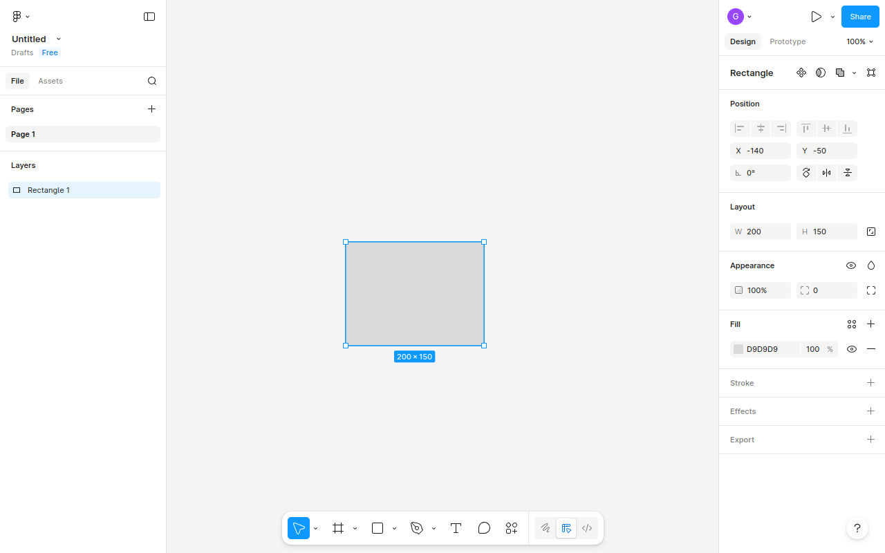

- **Atalho:** R
- **Criação:** Click+drag define o bounding box
- **Shift durante drag:** Constraina para quadrado perfeito
- **Alt durante drag:** Cria a partir do centro
- **Default:** Fill #D9D9D9, sem stroke
- **Após criar:** Selecionado com 8 handles (4 cantos + 4 edges)
- **Propriedades imediatas:** W, H, X, Y, Fill, Corner radius = 0

### 2.3 Ellipse Tool (O)

- **Atalho:** O
- **Criação:** Click+drag define o bounding box
- **Shift:** Constraina para círculo perfeito
- **Alt:** Cria a partir do centro

### 2.4 Line Tool (L)

- **Atalho:** L
- **Criação:** Click+drag define start e end point
- **Shift:** Constraina ângulos (0°, 45°, 90°, etc.)

### 2.5 Frame Tool (F)

- **Atalho:** F
- **Criação:** Click+drag define o frame
- **Sidebar mostra presets** de dispositivos (iPhone, Android, etc.)
- **Frame é container** — elementos podem ser filhos

### 2.6 Text Tool (T)

- **Atalho:** T
- **Click no canvas:** Cria text box com largura auto
- **Click+drag:** Cria text box com largura fixa
- **Entra em modo de edição** imediatamente
- **Escape:** Sai do modo de edição
- **Double-click em texto existente:** Edita o texto

---

## 3. SELEÇÃO E MANIPULAÇÃO

### 3.1 Move Tool (V)

- **Atalho:** V
- **Click em elemento:** Seleciona (deseleciona anterior)
- **Click em empty space:** Deseleciona tudo
- **Click + drag em elemento:** Move o elemento
- **Shift + click:** Toggle selection (adiciona/remove da seleção múltipla)

### 3.2 Multi-Seleção

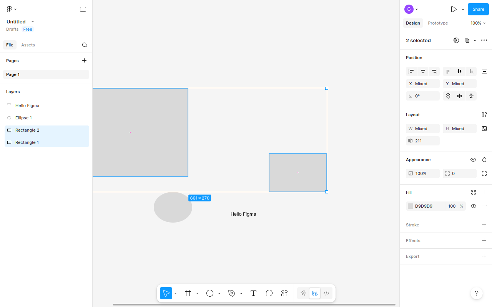

- **Shift + click:** Adiciona elemento à seleção
- **Ctrl + click:** Seleciona elementos dentro de grupos/frames (deep select)
- **Drag em empty space:** Cria retângulo de seleção (marquee select)

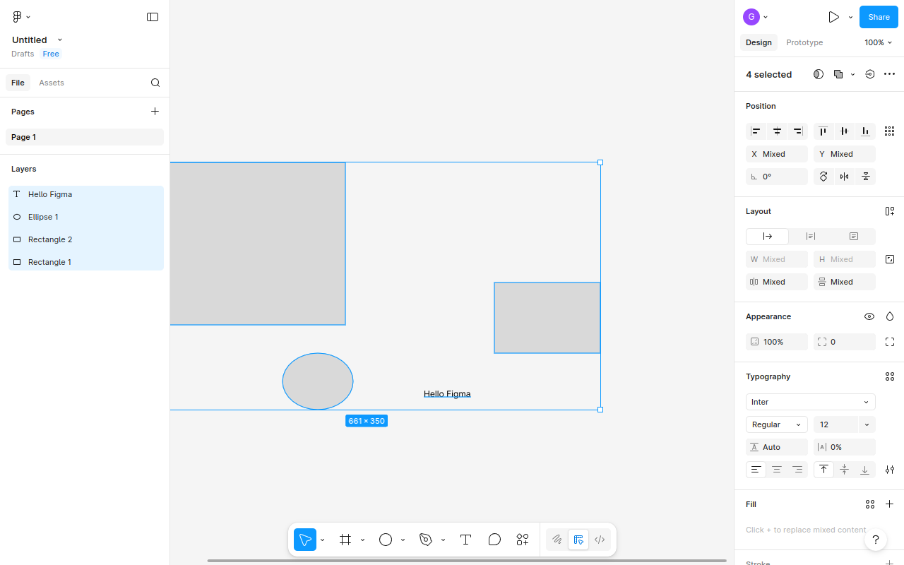

### 3.3 Selection Box (Bounding Box)

Quando selecionado, o elemento exibe:

- **Borda azul** contínua ao redor do elemento
- **8 handles** (círculos) nos 4 cantos + 4 centros de edges
- **Dimensão** mostrada abaixo (ex: "300 × 230")
- **Cursor muda** ao hover sobre handles:
  - Cantos: ↗ (resize diagonal)
  - Edges: ↔ ou ↕ (resize horizontal/vertical)
  - Centro do elemento: ✥ (move)

### 3.4 Resize

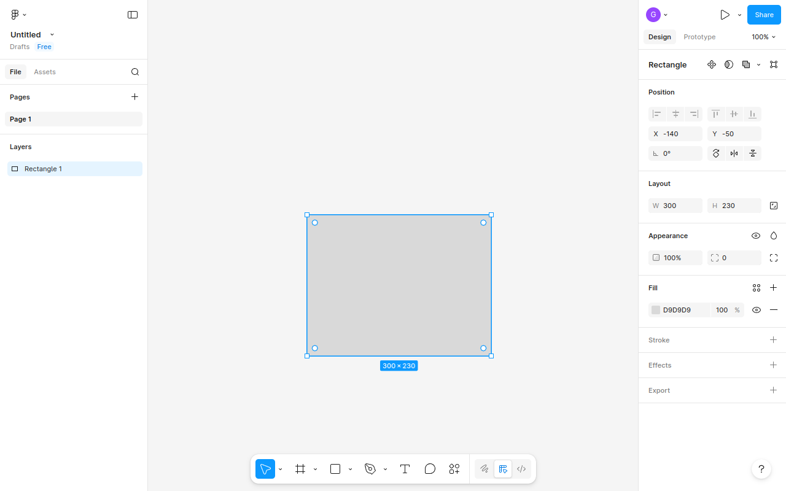

- **Drag de handle de canto:** Resize proporcional livre
- **Shift + drag de canto:** Constraina proporção (aspect ratio lock)
- **Alt + drag:** Resize a partir do centro
- **Drag de edge handle:** Resize em uma dimensão apenas
- **Resize é em tempo real** — o elemento e seu conteúdo redimensionam durante o drag
- **Width/Height no sidebar** atualizão em tempo real durante resize

### 3.5 Mover Elemento

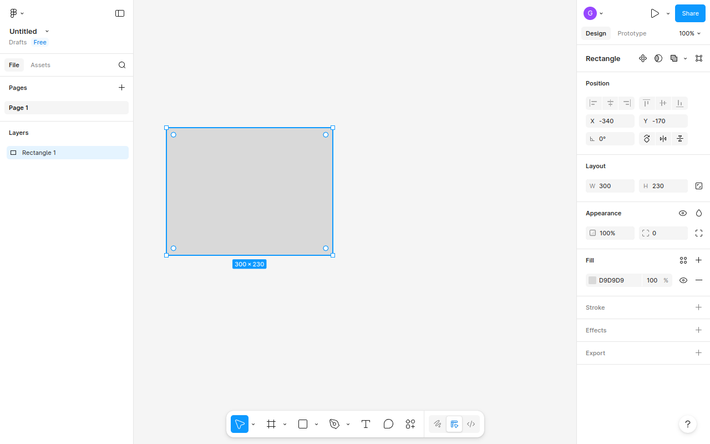

- **Click + drag** no centro do elemento
- **Arrow keys:** Move 1px por keystroke
- **Shift + Arrow:** Move 10px por keystroke
- **Smart guides** aparecem durante o movimento (linhas de alinhamento com outros elementos)
- **Snap to grid** quando grid está ativo
- **X, Y no sidebar** atualizão em tempo real

### 3.6 Rotação

- **Hover perto de um handle de canto** (mas fora do elemento): cursor muda para ↻
- **Drag** para rotar livremente
- **Shift + drag:** Constraina rotação a 15° increments
- **Rotation no sidebar** atualiza em tempo real

---

## 4. NAVEGAÇÃO DO CANVAS

### 4.1 Zoom

| Ação | Comportamento |
|------|--------------|
| **Ctrl + scroll wheel** | Zoom in/out centrado no cursor |
| **Ctrl + =** | Zoom in (step) |
| **Ctrl + -** | Zoom out (step) |
| **Ctrl + 0** | Zoom para 100% |
| **Ctrl + 1** | Zoom para caber o conteúdo |
| **Ctrl + 2** | Zoom na seleção |
| **Pinch (trackpad)** | Zoom in/out |

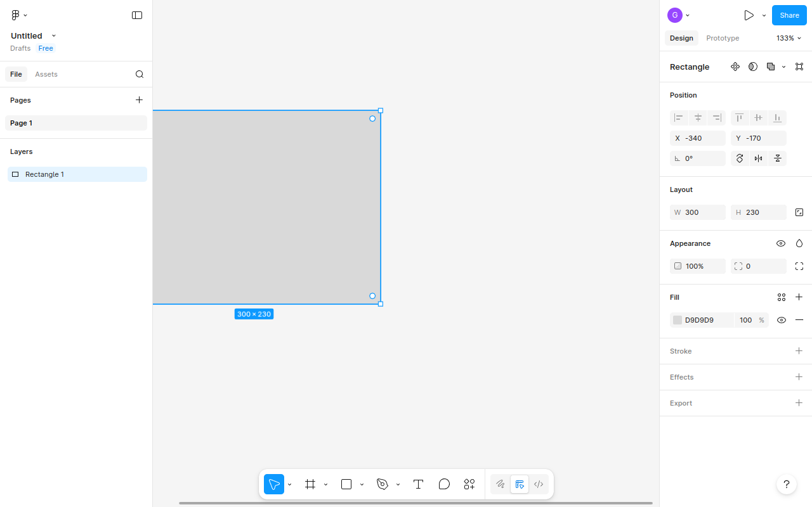

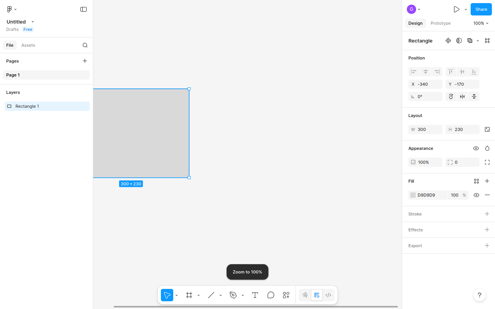

**Comportamento do zoom:**
- Zoom é centrado na posição do cursor (não no centro do viewport)
- O zoom % é exibido no canto superior direito do sidebar
- Steps de zoom: ...25%, 33%, 50%, 75%, 100%, 150%, 200%, 400%, 800%...
- Zoom mínimo: ~1%
- Zoom máximo: ~12800%

### 4.2 Pan (Scroll/Navegação)

| Ação | Comportamento |
|------|--------------|
| **Mouse wheel** | Scroll vertical (pan up/down) |
| **Shift + mouse wheel** | Scroll horizontal (pan left/right) |
| **Space + drag** | Pan livre (cursor muda para ✋) |
| **Middle mouse button + drag** | Pan livre |
| **H (Hand tool) + drag** | Pan livre |
| **Two-finger drag (trackpad)** | Pan livre |

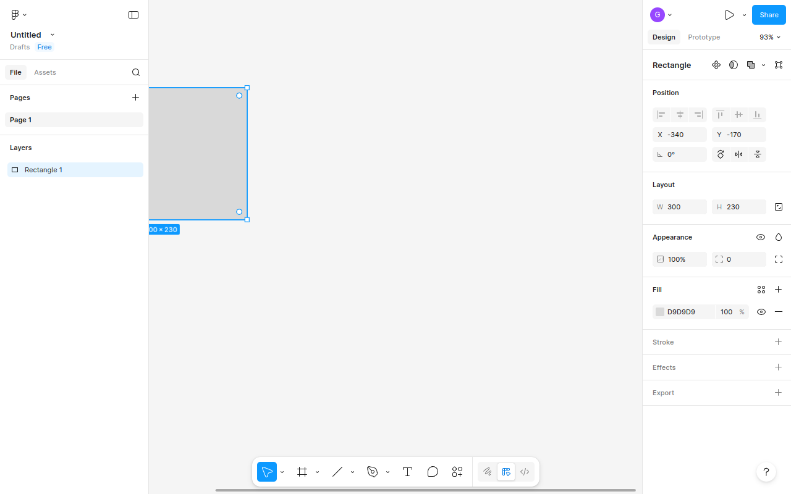

**Comportamento do pan:**
- Space é temporário — solta Space volta para ferramenta anterior
- Pan não tem limites — pode navegar infinitamente
- O canvas é infinito em todas as direções

---

## 5. CONTEXT MENU (Right-Click)

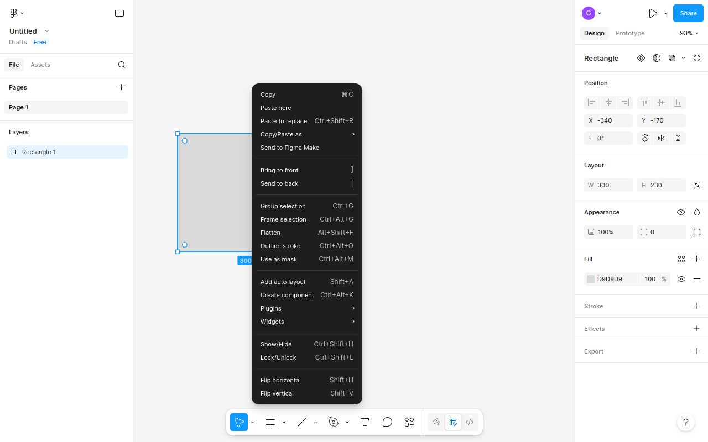

**Items do context menu (quando elemento selecionado):**

| Item | Atalho | Descrição |
|------|--------|-----------|
| Copy | Ctrl+C | Copia elemento |
| Paste here | Ctrl+V | Cola na posição do cursor |
| Paste to replace | Ctrl+Shift+V | Substitui seleção |
| Copy/Paste as... | → | Submenu: CSS, SVG, PNG |
| **Separador** | | |
| Set as thumbnail | — | Define como thumbnail do arquivo |
| **Separador** | | |
| Bring to front | Ctrl+] | Traz para frente (z-order) |
| Bring forward | ] | Avança uma camada |
| Send backward | [ | Recua uma camada |
| Send to back | Ctrl+[ | Envia para trás |
| **Separador** | | |
| Group selection | Ctrl+G | Agrupa seleção |
| Frame selection | Ctrl+Alt+G | Cria frame com seleção |
| **Separador** | | |
| Flatten | Ctrl+E | Achata vetores |
| Outline stroke | — | Converte stroke em fill |
| Use as mask | Ctrl+Alt+M | Usa como máscara |
| **Separador** | | |
| Add auto layout | Shift+A | Adiciona auto layout |
| **Separador** | | |
| Plugins | → | Submenu de plugins |
| Widgets | → | Submenu de widgets |
| **Separador** | | |
| Quick actions | Ctrl+/ | Busca de ações |
| Copy link | — | Copia link do elemento |

**Quando right-click em empty space (sem seleção):**
- Paste here
- Paste to replace
- Quick actions
- Plugins
- Widgets

---

## 6. AGRUPAMENTO E HIERARQUIA

### 6.1 Group (Ctrl+G)

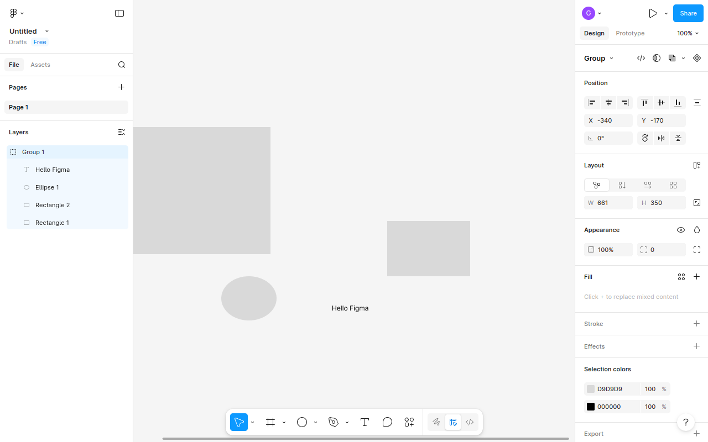

- Seleciona múltiplos elementos → Ctrl+G
- Cria um "Group" na árvore de layers
- Group aparece como pasta na layers tree
- Double-click no group: entra no modo de edição do grupo
- Click fora do grupo: sai do modo de edição
- Ungroup: Ctrl+Shift+G

### 6.2 Frame (Ctrl+Alt+G)

- Similar ao Group mas é um container com clip
- Tem propriedades próprias de layout (Auto Layout)
- Pode ter background, stroke, corner radius
- Funciona como viewport — conteúdo fora dos limites é cortado

### 6.3 Ordem Z (Stacking)

- **Ctrl+]** = bring to front (mais acima)
- **]** = bring forward (uma camada acima)
- **[** = send backward (uma camada abaixo)
- **Ctrl+[** = send to back (mais atrás)
- Drag na layers tree também reordena

---

## 7. KEYBOARD SHORTCUTS COMPLETOS

### 7.1 Ferramentas

| Atalho | Ação |
|--------|------|
| V | Move tool |
| K | Scale tool |
| F | Frame tool |
| R | Rectangle tool |
| O | Ellipse tool |
| L | Line tool |
| P | Pen tool |
| Shift+P | Pencil tool |
| T | Text tool |
| C | Comment tool |
| H | Hand tool (pan) |
| I | Color picker (eyedropper) |

### 7.2 Edição

| Atalho | Ação |
|--------|------|
| Ctrl+C | Copy |
| Ctrl+X | Cut |
| Ctrl+V | Paste |
| Ctrl+D | Duplicate in place |
| Alt+drag | Duplicate by dragging |
| Ctrl+Z | Undo |
| Ctrl+Shift+Z / Ctrl+Y | Redo |
| Delete / Backspace | Delete selection |
| Ctrl+A | Select all |
| Escape | Deselect / exit mode |
| Enter | Enter group/frame / start editing text |

### 7.3 Agrupamento

| Atalho | Ação |
|--------|------|
| Ctrl+G | Group selection |
| Ctrl+Shift+G | Ungroup |
| Ctrl+Alt+G | Frame selection |

### 7.4 Zoom/View

| Atalho | Ação |
|--------|------|
| Ctrl+scroll | Zoom |
| Ctrl+= | Zoom in |
| Ctrl+- | Zoom out |
| Ctrl+0 | Zoom 100% |
| Ctrl+1 | Zoom to fit |
| Ctrl+2 | Zoom to selection |
| Space+drag | Pan |
| Shift+1 | Toggle left sidebar |
| Shift+scroll | Horizontal scroll |

### 7.5 Alinhamento

| Atalho | Ação |
|--------|------|
| Alt+A | Align left |
| Alt+D | Align right |
| Alt+W | Align top |
| Alt+S | Align bottom |
| Alt+H | Align center horizontal |
| Alt+V | Align center vertical |

### 7.6 Transformação

| Atalho | Ação |
|--------|------|
| Arrow keys | Move 1px |
| Shift+Arrow | Move 10px |
| Ctrl+Shift+H | Flip horizontal |
| Ctrl+Shift+V | Flip vertical |
| Shift+drag (resize) | Constrain proportions |
| Alt+drag (resize) | Resize from center |
| Shift+drag (rotate) | Constrain to 15° |

---

## 8. PROPRIEDADES DETALHADAS POR TIPO DE ELEMENTO

### 8.1 Rectangle

**Position:** X, Y, Rotation, Alignment (6 buttons), Flip H/V
**Layout:** W, H, Lock aspect ratio
**Appearance:** Opacity, Corner radius (individual per corner), Blend mode
**Fill:** Color (solid, linear gradient, radial gradient, angular gradient, diamond gradient, image)
**Stroke:** Color, Weight, Position (inside/outside/center), Type (solid/dash), Cap, Join
**Effects:** Drop shadow, Inner shadow, Layer blur, Background blur
**Export:** PNG, JPG, SVG, PDF — scale 1x/2x/3x/4x

### 8.2 Text

Tudo do Rectangle, mais:
**Text properties:** Font family, Weight, Size, Line height, Letter spacing, Paragraph spacing
**Text alignment:** Left, Center, Right, Justify
**Text decoration:** None, Underline, Strikethrough
**Text transform:** None, Uppercase, Lowercase, Capitalize
**Auto resize:** Fixed size, Hug contents (width), Hug contents (height)
**Text truncation:** Ellipsis with line clamp

### 8.3 Frame

Tudo do Rectangle, mais:
**Layout:** Auto layout (direction, spacing, padding, alignment)
**Constraints:** Horizontal (left/center/right/stretch), Vertical (top/center/bottom/stretch)
**Clip content:** Toggle (content fora do frame é cortado)
**Fill:** Pode ter múltiplos fills

### 8.4 Ellipse

Mesmas propriedades do Rectangle.
**Especial:** Arc controls (start angle, end angle, inner radius ratio)

### 8.5 Line

**Position:** X, Y, Rotation
**Layout:** Length, Angle
**Stroke:** Color, Weight, Cap (None, Round, Square), Dash pattern

### 8.6 Image

**Fill:** Image com opções de Tile, Fill, Fit, Crop
**Exposure, Contrast, Saturation, Temperature, Tint, Highlights, Shadows**

---

## 9. SMART GUIDES E SNAPPING

### 9.1 Smart Guides

- **Linhas vermelhas/magenta** aparecem durante move/resize
- Mostram alinhamento com outros elementos:
  - Alinhamento de edges (top, bottom, left, right)
  - Alinhamento de centros
  - Espaçamento igual entre elementos
- **Distance indicators** aparecem mostrando pixels entre elementos

### 9.2 Snapping

- **Snap to objects:** Elementos se encaixam em edges/centros de outros
- **Snap to pixel grid:** Coordenadas arredondam para inteiros
- **Snap to geometry:** Pontos especiais (centros, terços)

---

## 10. LAYERS TREE — COMPORTAMENTO DETALHADO

### 10.1 Tipos de Nó na Árvore

| Ícone | Tipo | Descrição |
|-------|------|-----------|
| □ | Rectangle | Retângulo/forma |
| ○ | Ellipse | Elipse/círculo |
| T | Text | Texto |
| # | Frame | Container com clip |
| ⊞ | Group | Agrupamento simples |
| ◇ | Component | Componente reutilizável |
| ↳ | Instance | Instância de componente |
| — | Line | Linha/vetor |
| ✏ | Vector | Forma vetorial complexa |
| 🖼 | Image | Imagem |

### 10.2 Interações na Tree

| Ação | Resultado |
|------|-----------|
| Click | Seleciona elemento (e no canvas) |
| Double-click | Renomeia o item |
| Drag | Reordena (move z-order) |
| Drag para dentro de outro | Move para dentro do grupo/frame |
| Ícone 👁 (hover) | Toggle visibilidade |
| Ícone 🔒 (hover) | Toggle lock |
| Right-click | Context menu específico de layers |
| ▸/▾ | Expand/collapse children |

### 10.3 Indicadores Visuais na Tree

- **Selecionado:** Background highlight azul
- **Hover:** Background highlight sutil
- **Locked:** Ícone 🔒 visível
- **Hidden:** Ícone 👁 com linha, texto mais opaco
- **Grupo expandido:** Filhos indentados com linhas guia

---

## 11. CURSOR STATES

| Contexto | Cursor |
|----------|--------|
| Move tool (canvas vazio) | Default (seta) |
| Move tool (hover em elemento) | Move (✥ com setas) |
| Hover em handle de canto | Diagonal resize (↗) |
| Hover em handle de edge | H/V resize (↔/↕) |
| Hover perto de canto (rotação) | Rotate (↻) |
| Frame/Rect/Ellipse tool | Crosshair (+) |
| Text tool | Text cursor (I) |
| Hand tool / Space held | Hand (✋) |
| Hand tool + dragging | Grab (✊) |
| Pen tool | Pen (+) |
| Color picker (I) | Eyedropper |
| Resize em andamento | Resize cursor mantido |

---

## 12. COMPARAÇÃO: FIGMA vs NOSSO EDITOR ATUAL

| Funcionalidade | Figma | Nosso Editor | Status |
|---------------|-------|-------------|--------|
| Canvas infinito com zoom/pan | ✅ Ctrl+scroll zoom, Space+drag pan | ❌ Zoom por botões, sem pan por drag | **IMPLEMENTAR** |
| Draw-to-create (click+drag) | ✅ Todas as ferramentas | ❌ Click adiciona direto | **IMPLEMENTAR** |
| Resize em tempo real | ✅ Handles funcionais com cursor correto | ⚠️ Bugado, não redimensiona visualmente | **CORRIGIR** |
| Drag element (mover) | ✅ Funciona mesmo fora do canvas | ⚠️ Não funciona fora da etiqueta | **CORRIGIR** |
| Context menu | ✅ Completo com todos os items | ⚠️ Bugado, nem sempre aparece | **CORRIGIR** |
| Multi-select (Shift+click) | ✅ | ❌ | **IMPLEMENTAR** |
| Marquee select (drag em vazio) | ✅ | ❌ | **IMPLEMENTAR** |
| Smart guides | ✅ Linhas de alinhamento | ❌ | **FUTURO** |
| Snap to objects | ✅ | ❌ | **FUTURO** |
| Group/Ungroup | ✅ Ctrl+G/Ctrl+Shift+G | ⚠️ Parcialmente wired | **REFINAR** |
| Layers tree com drag | ✅ Reorder, reparent, lock, hide | ⚠️ Tree existe mas sem drag reorder | **REFINAR** |
| Propriedades completas | ✅ Position, Layout, Fill, Stroke, Effects | ⚠️ Tipografia, cores, border básicos | **EXPANDIR** |
| Undo/Redo | ✅ Ctrl+Z/Ctrl+Y | ⚠️ Hook existe mas não registra commands | **IMPLEMENTAR** |
| Keyboard shortcuts | ✅ Extensos (30+) | ⚠️ Básicos (Delete, Copy, Paste) | **EXPANDIR** |
| Text editing inline | ✅ Double-click para editar | ❌ | **IMPLEMENTAR** |
| Color picker | ✅ HSB/RGB/HEX com presets | ⚠️ Input type=color básico | **MELHORAR** |
| Grid overlay | ✅ Configurável | ✅ Toggle simples 10px | **OK** |
| Rotation | ✅ Drag perto de canto | ⚠️ Só via input no panel | **MELHORAR** |
| Constraint system | ✅ | ❌ | **FUTURO** |
| Auto layout | ✅ | ❌ | **FUTURO** |
| Export (PNG/SVG/PDF) | ✅ | ❌ | **FUTURO** |
| Ruler/guides | ✅ | ❌ | **FUTURO** |
| Boolean operations | ✅ Union, Subtract, Intersect, Exclude | ❌ | **FUTURO** |

---

## 13. ROADMAP DE IMPLEMENTAÇÃO (PRIORIZADO)

### Prioridade 1 — Críticos (Bugfixes + Core)
1. **Zoom com mouse wheel** (Ctrl+scroll) centrado no cursor
2. **Pan com Space+drag** e mouse wheel para scroll
3. **Resize funcional** em tempo real com todos os handles
4. **Drag de elementos** funcionando dentro E fora da etiqueta
5. **Context menu** aparecendo corretamente em right-click
6. **Draw-to-create** (click+drag na canvas para definir dimensão do elemento)

### Prioridade 2 — Seleção e Manipulação
7. **Multi-select** com Shift+click
8. **Marquee select** (drag em espaço vazio)
9. **Cursor states** corretos por contexto
10. **Undo/Redo** funcional com command stack
11. **Keyboard shortcuts** expandidos (V, R, T, H, Delete, arrows, etc.)

### Prioridade 3 — Refinamentos
12. **Smart guides** durante move/resize
13. **Snap to objects**
14. **Text editing** inline (double-click)
15. **Rotation** via drag perto de corner handle
16. **Layers tree** com drag reorder e reparent
17. **Color picker** melhorado

### Prioridade 4 — Avançado (Futuro)
18. Auto layout
19. Constraints
20. Boolean operations
21. Export
22. Ruler/guides
23. Components system

---

---

## 14. COLOR PICKER — DETALHAMENTO COMPLETO

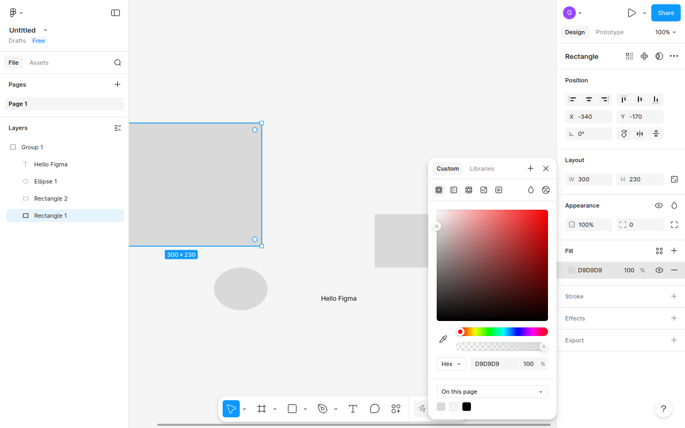

### 14.1 Estrutura do Color Picker

O color picker abre como popover flutuante ao clicar no swatch de cor (Fill ou Stroke).

**Tabs superiores:**
- **Custom** — picker manual
- **Libraries** — cores de bibliotecas/estilos

**Tipo de fill (ícones, esquerda → direita):**
| # | Ícone | Tipo |
|---|-------|------|
| 1 | ■ | Solid color |
| 2 | ↗ | Linear gradient |
| 3 | ⊕ | Radial gradient |
| 4 | ↺ | Angular gradient |
| 5 | ◇ | Diamond gradient |
| 6 | 🖼 | Image fill |

**Componentes visuais:**
1. **Color area** (grande quadrado ~200×200px) — HSB: horizontal = Saturation, vertical = Brightness
2. **Hue bar** (barra horizontal arco-íris) — seleciona matiz (0°-360°)
3. **Opacity bar** (barra horizontal checkered→cor) — seleciona opacity (0%-100%)
4. **Eyedropper** (ícone conta-gotas à esquerda) — pick color do canvas
5. **Color mode dropdown** — Hex (padrão), RGB, CSS, HSL, HSB
6. **Hex input** — ex: D9D9D9
7. **Opacity input** — ex: 100 %
8. **Scope dropdown** — "On this page" / "All pages" / "Selection"
9. **Recent colors** — swatches das últimas cores usadas

### 14.2 Gradientes

Quando tipo gradiente é selecionado:
- **Gradient bar** aparece no topo com stops de cor
- **Click na barra** adiciona novo stop
- **Drag stop** reposiciona
- **Click em stop** → selecionado → color area mostra cor daquele stop
- **Delete** remove stop selecionado
- **No canvas:** handles de gradiente aparecem para ajustar direção/raio

### 14.3 Image Fill

Quando Image é selecionado:
- **Upload area** para selecionar imagem
- **Modos:** Fill, Fit, Crop, Tile
- **Exposure, Contrast, Saturation, Temperature, Tint, Highlights, Shadows** — sliders de ajuste

---

## 15. TEXT PROPERTIES — DETALHAMENTO COMPLETO

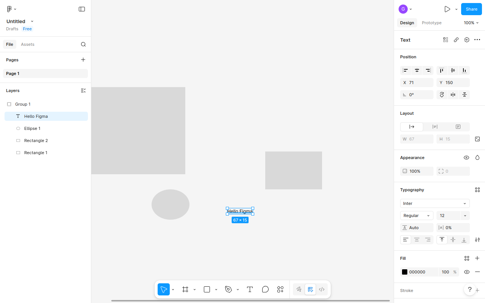

### 15.1 Painel de Typography (quando texto selecionado)

A seção "Typography" aparece no right sidebar quando um Text element está selecionado:

| Propriedade | Input | Descrição |
|------------|-------|-----------|
| **Font family** | Dropdown searchable | Ex: "Inter" — lista todas as Google Fonts + local |
| **Font weight** | Dropdown | Regular, Medium, SemiBold, Bold, etc. |
| **Font size** | Number input + dropdown | Em pixels (12, 14, 16, etc.) |
| **Line height** | Number input | "Auto" ou valor em px/% |
| **Letter spacing** | Number input | Em % ou px |
| **Paragraph spacing** | (via "..." more options) | Espaço entre parágrafos |
| **Text alignment H** | 4 buttons | Left, Center, Right, Justify |
| **Text alignment V** | 3 buttons | Top, Middle, Bottom |
| **Auto resize** | 3 buttons | Auto width, Fixed width, Auto height |

### 15.2 Modos de Edição de Texto

- **Click em texto** = seleciona o Text element (mostra bounding box)
- **Double-click** = entra no modo de edição (cursor dentro do texto)
- **No modo de edição:** pode selecionar parte do texto e aplicar estilos diferentes (mixed styles)
- **Escape** = sai do modo de edição
- **Enter** = quebra de linha
- **Ctrl+B** = bold, **Ctrl+I** = italic, **Ctrl+U** = underline

### 15.3 Text Truncation

- **Overflow:** visible ou hidden (clip)
- **Truncation:** texto longo mostra "..." (via CSS -webkit-line-clamp)
- Configurado via Layout → Auto resize mode

---

## 16. MAIN MENU (Hamburger) — SUBMENUS

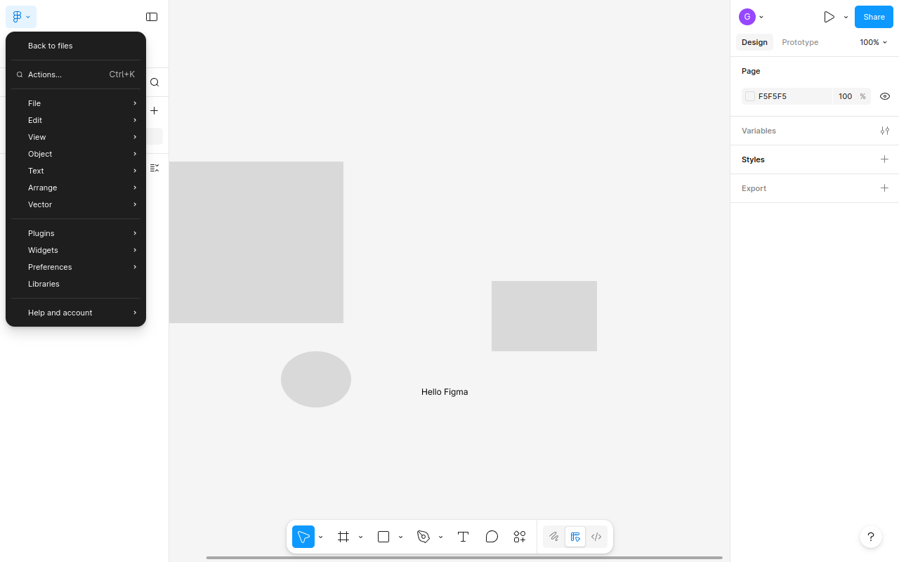

### 16.1 Estrutura do Menu

| Categoria | Items Principais |
|-----------|-----------------|
| **File** | New, Open, Save, Save as, Export, Version history |
| **Edit** | Undo, Redo, Cut, Copy, Paste, Paste over, Find/Replace, Select all |
| **View** | Zoom in/out, Fit, Grid, Rulers, Outlines, Pixel preview, Layout grids |
| **Object** | Group, Ungroup, Frame, Flatten, Outline stroke, Boolean ops, Bring/Send |
| **Text** | Bold, Italic, Underline, Strikethrough, Alignment, List, Transform |
| **Arrange** | Align left/right/top/bottom/center, Distribute, Tidy up |
| **Vector** | Join, Flatten, Boolean operations |
| **Plugins** | Installed plugins |
| **Widgets** | Widget manager |
| **Preferences** | Snap to, Grid, Nudge amount, Theme |
| **Libraries** | Team libraries, Enable/disable |
| **Help** | Keyboard shortcuts, What's new, Community |

---

## 17. DROPDOWNS DAS FERRAMENTAS

### 17.1 Shape Tool Dropdown

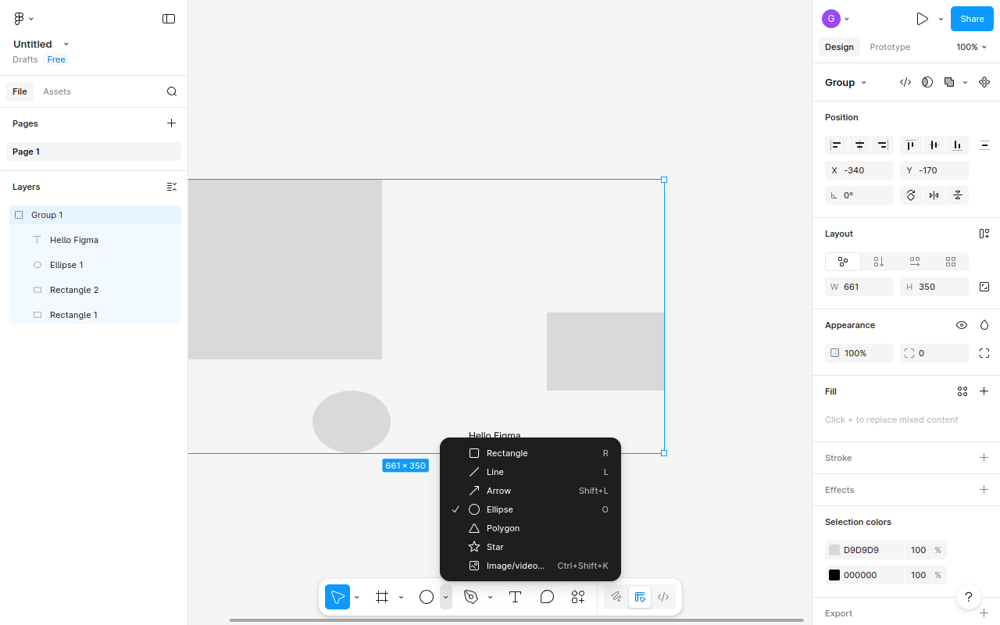

| Item | Atalho | Descrição |
|------|--------|-----------|
| Rectangle | R | Retângulo |
| Line | L | Linha |
| Arrow | Shift+L | Seta |
| Ellipse | O | Elipse/círculo |
| Polygon | — | Polígono regular |
| Star | — | Estrela |
| Place image | Ctrl+Shift+K | Inserir imagem |

### 17.2 Frame Tool Dropdown

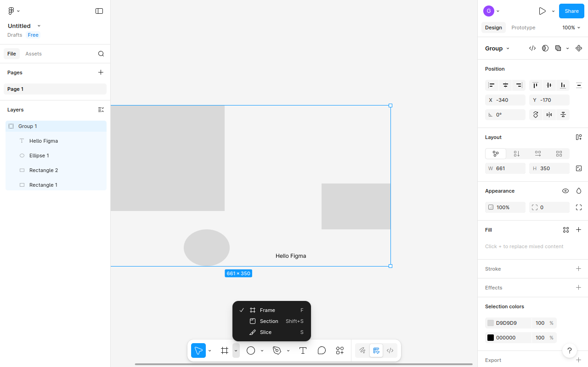

| Item | Atalho | Descrição |
|------|--------|-----------|
| Frame | F | Container com clip |
| Section | Shift+S | Seção organizacional |
| Slice | S | Área de export |

---

## 18. INTERAÇÕES AVANÇADAS

### 18.1 Alt+Drag para Duplicar

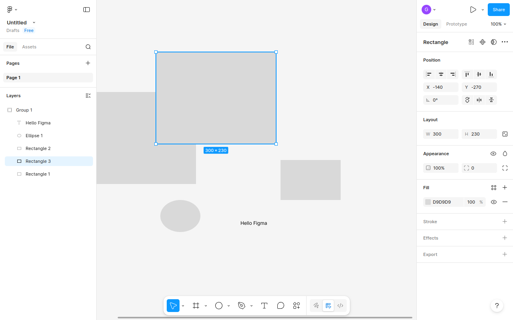

- **Alt + drag** em elemento selecionado = cria cópia na posição onde soltar
- Novo elemento aparece na layers tree (ex: "Rectangle 3")
- Original permanece inalterado
- Funciona com multi-seleção (duplica todos)

### 18.2 Double-Click em Group

- **Click** em grupo = seleciona o grupo inteiro
- **Double-click** em grupo = "entra" no grupo (modo de edição)
- Dentro do grupo: pode selecionar/editar elementos filhos individualmente
- **Escape** = sai do grupo (volta para seleção do grupo inteiro)
- **Click fora** do grupo = também sai

### 18.3 Arrow Keys para Mover

- **Arrow key** = move 1px na direção
- **Shift + Arrow** = move 10px (valor configurável em Preferences)
- Funciona com multi-seleção
- Registra no undo stack

### 18.4 Quick Actions (Ctrl+K ou Ctrl+/)

- Abre barra de busca centralizada tipo spotlight/command palette
- Busca por: ações, plugins, tools, shortcuts, menu items
- Enter para executar ação selecionada
- Similar ao nosso SpotlightSearch

---

## 19. COMPORTAMENTOS DETALHADOS DE CANVAS

### 19.1 Canvas Infinito

- O canvas do Figma é infinito em todas as direções
- Fundo padrão: #F5F5F5 (cinza claro)
- Elementos podem estar em qualquer coordenada (X/Y negativos ou positivos)
- Não há "bounds" — o canvas se estende conforme necessário

### 19.2 Zoom Behavior

- **Zoom centrado no cursor**: quando faz Ctrl+scroll, o ponto sob o cursor permanece na mesma posição de tela
- **Zoom steps**: não é linear — segue escala predefinida (25%, 33%, 50%, 75%, 100%, 150%, 200%, etc.)
- **Zoom mínimo**: ~1% (mostra visão geral de tudo)
- **Zoom máximo**: ~12800% (mostra pixels individuais)
- **Indicador**: zoom % no canto superior direito (clicável → dropdown com presets)

### 19.3 Scroll/Pan Behavior

- **Scroll wheel** (sem modifier) = pan vertical
- **Shift + scroll** = pan horizontal
- **Ctrl + scroll** = zoom
- **Space + drag** = pan livre (temporário, volta para tool anterior ao soltar Space)
- **Middle click + drag** = pan livre
- **Trackpad two-finger** = pan (natural scrolling)
- **Trackpad pinch** = zoom

### 19.4 Grid

- **View → Layout grid** ou atalho (Ctrl+G no elemento / Ctrl+' toggle)
- Grid pode ser: linhas, colunas, ou quadriculado
- Cor, tamanho, e opacity configuráveis
- Snap to grid quando ativo
- Grid é por frame (não global)

---

## 20. FIGMA SPECIFIC BEHAVIORS PARA REPLICAR

### 20.1 Tool Auto-Switch

Após criar um elemento com qualquer tool de criação (R, O, F, T, L):
- A ferramenta volta automaticamente para **Move (V)**
- Exceto se o usuário segurar a tecla da ferramenta

### 20.2 Selection Feedback

- **Hover** (sem click): mostra borda de highlight sutil (azul claro, 1px)
- **Click**: mostra bounding box com handles
- **No selection**: sidebar mostra Page properties
- **Single selection**: sidebar mostra element properties
- **Multi-selection**: sidebar mostra mixed properties (com "Click + to replace mixed content" para fills)

### 20.3 Measurement Display

- Dimensões mostradas abaixo do elemento: "W × H" em pill azul
- Durante resize: dimensão atualiza em tempo real
- **Alt + hover** com elemento selecionado: mostra distância até os edges do elemento pai (em vermelho)

### 20.4 Snap Guides

- **Linhas magenta/vermelhas** aparecem automaticamente durante move/resize
- Mostram alinhamento com:
  - Edges de outros elementos (top, bottom, left, right)
  - Centros de outros elementos
  - Espaçamento igual entre 3+ elementos
- **Distance labels** aparecem mostrando pixels de gap

---

*Documento gerado via análise interativa do Figma Design Editor usando Playwright.*
*Cada screenshot foi capturada durante interações reais no Figma.*
*Total de screenshots: 51*
*Total de interações testadas: 28 batches*
